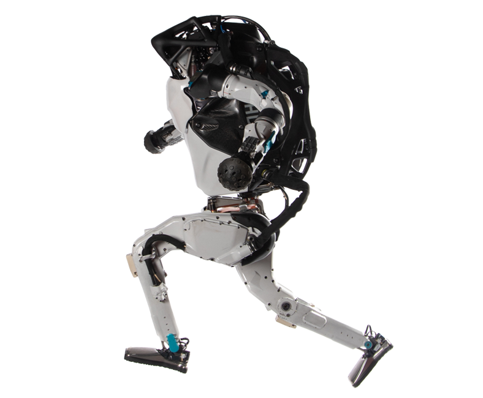
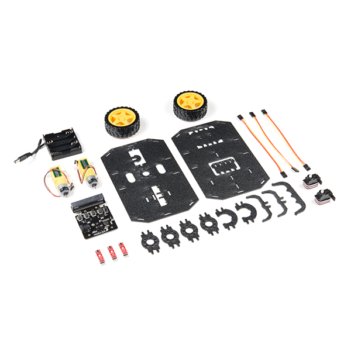

# Introduction to Robotics

## Table of Contents

[TOC]

## Overview

Robotics is the intersection of multiple engineering fields. In my opinion, the pinnacle of robotics engineering is Boston Dynamics' [Atlas](https://www.bostondynamics.com/atlas) robot. This robot is only possible with the collaboration of multiple engineering disciplines.

|  |  |  |
| :--------------------------------------------: | :--------------------------------------------------: | :-------------------------------------------------: |
|               *Figure 1: Atlas*                |               *Figure 2: Atlas Frame*                |              *Figure 3: Atlas Upright*              |

Looking at the figures above, the evidently shown engineering disciplines are mechanical, electrical, software. However other fields do contribute but for the sake of simplicity, let's make those the three primary.

For example, let's take SparkFun's [micro:bot](https://www.sparkfun.com/products/16275) below.

|  |
| :--------------------------------------------------------: |
|                   *Figure 4: micro:bot*                    |

[Back to Top](#introduction-to-robotics)

## Robotics Sub-Disciplines

### Mechanical

|  |
| :----------------------------------------------: |
|          *Figure 5: micro:bot chassis*           |

### Electrical

|  |  |
| :-------------------------------------------------: | :--------------------------------------------------: |
|             *Figure 6: moto:bit Traces*             |             *Figure 7: moto:bit Drawing*             |

### Software

```python
from microbit import i2c


class MotoBit():
    '''Initialize moto:bit hardware.
    '''
    I2C_ADDR = 0x59         # 89
    CMD_ENABLE = 0x70       # 112
    CMD_SPEED_LEFT = 0x21   # 33
    CMD_SPEED_RIGHT = 0x20  # 32

    def __init__(self):
      	# cool code that you'll write
        # lol I can't give you all the answers
        pass

    def enable(self):
        '''Enable motor driver.
        '''
        i2c.write(self.I2C_ADDR, bytes([self.CMD_ENABLE, 0x01]))

    def disable(self):
        '''Disable motor driver.
        '''
        i2c.write(self.I2C_ADDR, bytes([self.CMD_ENABLE, 0x00]))

    def drive(self, speed_left, speed_right):
        '''Drive motors continuously based on 100 point scale.
        Args:
            speed_left (int|float): Motor power value. [-100, 100]
            speed_right (int|float): Motor power value. [-100, 100]
        '''
        speeds = [speed_left, speed_right]
        # cool code that you'll write
        # lol think again, no free answers here
        i2c.write(self.I2C_ADDR, bytes([self.CMD_SPEED_LEFT, speeds[0]]))
        i2c.write(self.I2C_ADDR, bytes([self.CMD_SPEED_RIGHT, speeds[1]]))
```

[Back to Top](#introduction-to-robotics)

## Robot Components

|  |
| :------------------------------------------------------------: |
|               *Figure 8: micro:bot Disassembled*               |

### Microcontroller

|  |
| :-----------------------------------------------: |
|               *Figure 9: micro:bit*               |

### Motor Controller

|  |
| :----------------------------------------------: |
|              *Figure 10: moto:bit*               |

### Motors

|  |
| :---------------------------------------------: |
|          *Figure 11: micro:bot Motors*          |

To move the motors we will use I2C commands sent from the micro:bit.

Motor speed is determined by a value from this range [0, 255].

| Reverse 100% | Reverse 50% | 0% Speed | Forward 50%  | Forward 100% |
| :----------: | :---------: | :------: | :----------: | :----------: |
|      0       | round(63.5) | 127,128  | round(191.5) |     255      |
|     -100     |     -50     |    0     |      50      |     100      |

### Sensors

|  |
| :---------------------------------------------: |
|          *Figure 12: micro:bot sensor*          |

To simplify sensors, let's say only digital and analog sensors exist.

#### Digital Sensors

Digital sensors can only output **HIGH** or **LOW**. You could also say output a 1 or 0.

|  LOW  | HIGH  |
| :---: | :---: |
|   0   |   1   |

#### Analog Sensors

Analog sensors can output a range of values. For example, they can output [0, 255] or [0, 1023].

##### Analog Infrared Sensor

For this section, let's assume the analog values range from [0, 1023].

|  |
| :-------------------------------------------------: |
|            *Figure 13: Infrared Sensor*             |

The way this sensor works is it emits light that we can't see and detects how much comes back. For example, if an object is really close to the sensor, most of the light will bounce back onto the sensor and we could read a high value close to 1000. If that same object is really far from the sensor, most of the light will bounce and scatter in away from the sensor and we'll read a low value around 5.

###### Detecting Color

|  |
| :-----------------------------------------------------: |
|      *Figure 14: Infrared Sensor detecting color*       |

When the object you are detecting can have different colors, the sensor can detect carrying values. A great example is wearing black on a sunny day compared to white. The color black naturally absorbs more energy/light compared to other colors. The same applies to infrared sensors. This is a how our robot will know if it follows a path. Because when the sensor is over black, we will read a lower value compared to normal white paper.